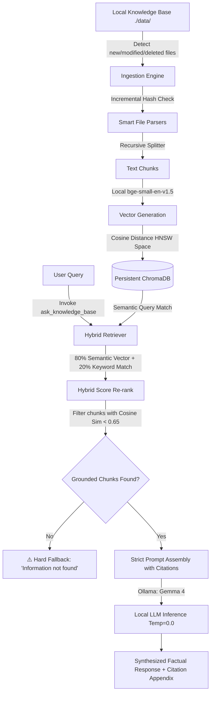

# 🛰️ Antigravity Local RAG: Offline Grounded Q&A MCP Server

Antigravity Local RAG is a fully offline, high-precision Retrieval-Augmented Generation (RAG) system integrated with the Model Context Protocol (MCP) using **FastMCP**. It combines local semantic embeddings, hybrid re-ranking, strict cosine relevance thresholds, and local Large Language Models (LLMs) via **Ollama** to provide highly accurate, verified answers backed by inline citations.

Designed with **hallucination resistance** as its core principle, the engine programmatically rejects out-of-domain queries—such as *quantum key cryptography*—with a clean "not found" fallback rather than speculating.

---

## 🛠️ System Architecture

The following diagram illustrates the lifecycle of document ingestion, hybrid vector retrieval, strict grounding filtering, and local LLM inference:



---

## ✨ Core Features

1. **Incremental Indexing**: Uses SHA-256 file hashing to monitor files in `./data/knowledge_base/` for additions, updates, or deletions. Unchanged files are skipped to conserve compute.
2. **Multi-Extension Document Parsing**: Smart custom extractors for:
   - **PDF Documents** (`.pdf`) using hierarchical page markers.
   - **Word Documents** (`.docx`, `.doc`) using text layout extractors.
   - **Plain Text & Code** (`.txt`, `.md`, `.py`, `.js`, `.ts`, `.json`, etc.).
3. **Hybrid Re-ranking**: Searches local embeddings, then blends cosine semantic similarity (80%) with a term-frequency keyword matching score (20%).
4. **Anti-Hallucination Cosine Guardrail**: Filters all retrieved chunks below a cosine similarity threshold of **`0.65`**. Queries that yield no relevant data immediately return a clean "information not found" status to block LLM hallucinations.
5. **Zero-Temperature Inference**: Locks Ollama generation temperature to `0.0` and top-p to `0.1` to ensure absolute determinism and reliance on the provided context blocks.

---

## 🚀 Deployment Options

Choose the deployment strategy that best fits your environment.

### Option A: Local Native Deployment (Recommended)
This codebase provides an automated setup script that configures virtual environments, installs libraries, pre-downloads the embedding model, and launches Ollama dependencies.

1. **Run the Setup Script**:
   ```bash
   ./setup.sh
   ```
   *The script will automatically detect Python, configure `.venv`, install packages from `requirements.txt`, cache the local HuggingFace embedding model (`bge-small-en-v1.5`), verify the Ollama daemon, pull `gemma4:e4b`, and run the validation test suite.*

2. **Start the FastMCP Server**:
   ```bash
   source .venv/bin/activate
   python src/server.py
   ```

---

### Option B: Containerized Orchestration (Docker Compose)
If you want to isolate dependencies and run the entire RAG pipeline—including Ollama—in containerized space, use Docker Compose.

1. **Start all services**:
   ```bash
   docker compose up -d
   ```
   *This starts the Ollama engine, spins up an automated puller container that downloads `gemma4:e4b`, builds the RAG server container, and exposes it.*

2. **Verify services are running**:
   ```bash
   docker compose ps
   ```

---

## 🧰 FastMCP Tool Reference

Once connected as an MCP server, the following tools become available:

| Tool Name | Parameters | Description |
| :--- | :--- | :--- |
| `index_knowledge_base` | None | Scans files inside `data/knowledge_base/`, performs incremental index caching, and commits updates to ChromaDB. |
| `search_knowledge_base` | `query` (str), `limit` (int, default=5) | Executes a hybrid semantic-keyword query and returns raw matching text blocks, similarity scores, and local file links. |
| `ask_knowledge_base` | `query` (str) | Executes a fully-grounded offline Q&A pipeline. Returns local LLM response enriched with inline citations and a reference index. |

---

## 🧪 Grounding & Anti-Hallucination Showcase

To verify the robust guarding mechanisms, run the test script included in the root directory:
```bash
python test_rag.py
```

### Negative Control: "Quantum Key Cryptography"
The project knowledge base currently contains guides on **JWT Authentication** and **Hydraulic Pump Calibration**. Because **Quantum Key Cryptography** is completely absent, a query on it demonstrates the system's strict hallucination avoidance:

#### Question:
> *How does this system implement quantum key encryption?*

#### RAG System Output:
```text
⚠️ Information not found in the local knowledge base.

No relevant documents met the similarity threshold to answer this query.
```

---

## 📁 Directory Structure
```text
.
├── Dockerfile                  # Container definition for FastMCP RAG server
├── README.md                   # System manuals & documentation
├── docker-compose.yml          # Multi-container orchestration (Ollama + RAG)
├── requirements.txt            # Python dependencies
├── setup.sh                    # Onboarding configuration & diagnostic tool
├── test_rag.py                 # Grounding and anti-hallucination test suite
├── data/
│   ├── chroma/                 # SQLite database for vectors (Gitignored)
│   └── knowledge_base/         # Monitored directory for ingestible assets
│       ├── docs/               # Technical manuals and guides (e.g. auth_guide.md)
│       ├── notes/              # Operating manuals and files (e.g. pump_manual.md)
│       └── papers/             # Technical research archives
└── src/
    ├── config.py               # Constants, base paths, and similarity levels
    ├── indexer.py              # Incremental hash tracking and vector storage
    ├── llm.py                  # Prompt templates and Ollama connection interfaces
    ├── parser.py               # Smart recursive splitting and format decoders
    ├── retriever.py            # Hybrid ranking scoring algorithms
    └── server.py               # FastMCP Server registration entries
```
