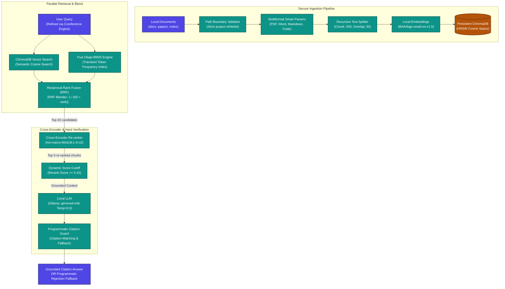

# 🛰️ Antigravity Local RAG (Version 2): Offline Grounded Q&A MCP Server

Antigravity Local RAG is a fully offline, high-precision **Retrieval-Augmented Generation (RAG)** system integrated with the **Model Context Protocol (MCP)** using **FastMCP**. It features parallel hybrid retrieval, Cross-Encoder re-ranking, dynamic relevance thresholding, programmatic citation guardrails, and secure path boundaries to provide bulletproof, hallucination-resistant answers entirely on your local machine.

---

## 🛠️ Upgraded System Architecture (Version 2)

The upgraded RAG pipeline introduces a multi-stage search, blend, re-rank, and programmatic validation lifecycle:



---

## ✨ Version 2 Advanced Features

### 1. True BM25 + Reciprocal Rank Fusion (RRF)
Vector-only search can miss precise technical identifiers, acronyms, or version numbers. Version 2 runs a parallel **Okapi BM25** keyword search alongside semantic vector search and blends the results using **Reciprocal Rank Fusion**:
$$RRF\_Score(d) = \sum_{m \in M} \frac{1}{60 + r_m(d)}$$
This balances conceptual semantics with exact term matching.

### 2. Local Cross-Encoder Re-Ranking
Features a local Cross-Encoder re-ranker using the `ms-marco-MiniLM-L-6-v2` model loaded via `sentence-transformers`. The pipeline fetches the top `20` candidates via RRF, re-evaluates absolute document-query relevance using full self-attention, and returns the top `5` highest quality chunks.

### 3. Programmatic Citation Guardrails
Consistently beats prompt-only grounding instructions. The generation engine programmatically verifies that:
- The LLM output contains inline `[Source: filename.ext]` citations.
- All cited documents exist within the supplied chunk context.
- Hallucinations or responses missing source citations are programmatically intercepted and replaced with a structured grounding fallback.

### 4. Conversational History & Coreference Resolution
Includes a sliding window conversation memory manager (last `3` turns). When a follow-up query is received, the local LLM resolves pronouns (e.g. *they*, *it*, *this*) and reformulates a self-contained search query before invoking retrieval.
- *User*: `Explain JWT authentication.`
- *User*: `How long are they valid?`
- *Refinement*: `How long are Access Tokens and Refresh Tokens valid?`

### 5. Secure Path Whitelisting
To prevent path-traversal vulnerabilities and secure sensitive directories, all indexing targets must pass a strict security validator. Scanning `/`, `/System`, `/etc`, `~/Library`, or any file outside the active workspace raises a secure `ValueError`.

### 6. Automated Evaluation Metrics Suite
Includes an automated quantitative evaluation script (`evaluate_rag.py`) that calculates **Mean Reciprocal Rank (MRR)** and **Recall@K** over structured test questions, comparing Baseline Vector (V1) against Upgraded Hybrid (V2) search to guarantee zero-regression quality.

---

## 🧰 FastMCP Tool Reference

The following tools are exposed directly to Antigravity over the Model Context Protocol (stdio):

| Tool Name | Parameters | Description |
| :--- | :--- | :--- |
| `index_knowledge_base` | None | Scans whitelisted folders inside `data/knowledge_base/`, performs incremental SHA-256 hash validation, and indexes changes into ChromaDB. |
| `search_knowledge_base` | `query` (str)<br/>`limit` (int, default=5)<br/>`category` (str, optional) | Executes a hybrid BM25-Vector RRF query, filters by dynamic threshold, and returns re-ranked chunks with confidence scores and file links. |
| `ask_knowledge_base` | `query` (str)<br/>`category` (str, optional)<br/>`session_id` (str, optional) | Executes the fully-grounded offline Q&A pipeline. Resolves thread history coreferences via `session_id`, validates grounding citations, and appends reference scores. |

In addition, a real-time diagnostic configuration resource is exposed:
* **Resource URI**: `config://status` — Returns server diagnostics, active embedding/generation models, relevance parameters, and a file manifest list.

---

## 🧪 Grounding & Memory Verification

You can run the fully automated test suites from the root directory to verify path whitelists, hybrid rankings, re-rank logits, and conversational memory resolution.

### Comparative Retrieval Evaluation:
Run the MRR and Recall evaluation metrics script:
```bash
.venv/bin/python evaluate_rag.py
```

### Conversational Memory & Grounding Scenarios:
Run the comprehensive multi-turn testing script:
```bash
.venv/bin/python test_rag.py
```

---

## 📁 Upgraded Directory Structure

```text
.
├── Dockerfile                  # Container definition for FastMCP RAG server
├── README.md                   # Complete Version 2 manuals & documentation
├── docker-compose.yml          # Containerized orchestration (Ollama + RAG)
├── requirements.txt            # Python dependencies (fastmcp, chromadb, transformers, etc.)
├── evaluate_rag.py             # Automated comparative MRR & Recall evaluation suite
├── test_rag.py                 # Multi-turn conversational memory validation suite
├── data/
│   ├── chroma/                 # Cosine similarity SQLite vector storage (Gitignored)
│   ├── logs/                   # Retrieval and execution audit logs (Gitignored)
│   │   ├── retrieval.log       # Context retrieval and similarity log auditor
│   │   └── llm.log             # Query rewrite and LLM transaction auditor
│   └── knowledge_base/         # Monitored directory for ingestible assets
│       ├── docs/               # Technical manuals and guides (e.g. auth_guide.md)
│       ├── notes/              # Operating manuals and notes (e.g. pump_manual.md)
│       └── papers/             # Technical research archives
└── src/
    ├── config.py               # Path validators, logs dirs, and model thresholds
    ├── indexer.py              # Incremental hash tracking and vector storage
    ├── llm.py                  # Sliding history manager, query rewriter, citation validator
    ├── parser.py               # Smart recursive splitting and format decoders
    ├── retriever.py            # BM25 indexing, RRF blender, Cross-Encoder re-ranker
    └── server.py               # FastMCP Server endpoints, tools, and status resource
```
